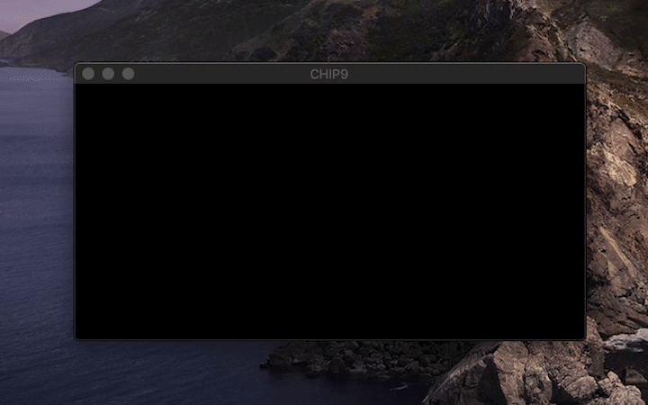

# CHIP9 Emu
_Project developped for Advanced Computer Programming exam @ Unimi_

Based on X-MAS CTF 2019 chall, CHIP9, is a 8-bit CPU with 64Kb of main memory (quite similar to Intel 8080 / Zilog Z80). CHIP9-Emu is an emulator for the architecture described in the chall.



## The challenge

> I found an old CHIP9 console in the attic and a cartridge with a program. Unfortunately the motherboard is gone and the console doesn't turn on anymore. The good news is that I also found the developer's manual, can you understand something more about it?

There are also 3 attachments provided, a PDF with the CPU design specification and 2 already compiled program: _bootrom_ and _rom_.

### First approach

The first approach in a CTF game is always get a better knowledge about the challenge, in this case it means doing some search involving the name of the challenge _CHIP9_ or something about that. Couriously i didn't find any page about a CPU or architecture called _CHIP9_. 

Serching more deepily I found some article and website about an emulator called _CHIP8_, it appears to be an interpreter for develop game code back in time. I also found a very well described [technical reference](http://devernay.free.fr/hacks/chip8/C8TECH10.HTM) about it and some [emulator](https://github.com/massung/CHIP-8). Unfortunately _CHIP8_ doesn't help so much, because it has very different architecture, very tight set of instruction compared to _CHIP9_, different register and also different memory and addresses size. I think that it was only a starting point that the writer of the challenge used to build it's architecture.

The next step, before starting to develop such architecture described in the _CHIP9_ specification PDF, is to take a look at the others two files included in the challenge: _bootrom_ and _rom_. I first scan them with _binwalk_ (a command line tool that scan files and serching for know headers) and after that I try to inspect the byte inside with _hexdump_. The files appears to be a raw ones, in fact they are only hex bytes program to _CHIP9_ as expected.

## Emulation

Emulation works on simulation behavior of an existing processor and it's individual components. So the goal is to build each individual piece of the system and then connect the pieces much like wires do in hardware. There are three ways of handling processor emulation (given an executable rom):

- Interpretation
- Static recompilation
- Dynamic recompilation

With all of these paths, there are same overall goal: execute a piece of code to modify processor state and interact with hardware (or better, emulated hardware). Processor state is composed by processor registers, interrupt handlers, etc for a given processor target. 

In this case I choose interpretation for building _CHIP9_ emulator, so the basic idea is read byte by byte the given rom, fetch the type of the instruction, simulate the operation like the hardware do and if it's needed update all components (like CPU registers, memory, etc). According to the _ACP_ project constraint I built the emulator in _C++_ with _Data Driven Programming_, _Object Orientation_ and _Generic Programming_.

## Architecture design
The CPU of the described system is an 8-bit little-endian (means that the word starts with the less significant bit and end with the most significant bit), quite similar to an Intel 8080 or a Zilog Z80. The system is equipped with a 64Kbyte of main memory (RAM) and some input/output device like a screen of 128x64 1-bit pixels (1-bit pixels means that every pixel is not RGB but can only be switch on or off) and a joystick with basic controller button (`A`, `B`, `UP`, `DOWN`, `RIGHT`, `LEFT`, `START`, `SELECT`).

### Registers

Every modern CPU according to the _von Neumann architecture_ have it's own registers, on-bord memory that contains data to be manipulated. In _CHIP9_ arch there are:

* 7 8-bit  general purpose registers: `A`, `B`, `C`, `D`, `E`, `H` and `L`.
* 3 16-bit general purpose registers: `BC`, `DE` and `HL` that are composed by the 
* Stack pointer `SP`, 16-bit register that takes track of the current position in the stack.
* Program counter `PC`, 16-bit register that indicate the position in memory of the next code instruction that will be execute.
* Flag `F`, 8-bit register that contains flags about the last math operation executed.

#### Stack pointer

As said before the `SP` register indicates the current position of the stack in memory. The stack is used for saving variables, saving return addresses, passing arguments to subroutines, and various other uses. With the `CALL` and `PUSH` instructions data are putted onto the stack; on the other hand with `POP` and `RET` instructions the CPU takes information off of the stack.

When data are pushed to the stack, it grows downward in memory (RAM), for this reason as default the `SP` should always be initialized with the highest memory location (top of RAM space `0xFFFE`); the corrisponding operation command can be `LDX SP, 0xFFFE` (or `22` `FE` `FF` in machine code). Another important facts is that the stack has to be always aligned with memory addresses.

#### Program counter

The `PC` register that indicate the position in memory of the next code instruction that need to be execute, once this instruction has been executed the register will indicate the next byte in memory. If a `JUMP` instruction occours the `PC` register can be change it's value according to the jump indication. Some kind of instruction (eg. the ones that invove immediate like `ADDI`) need some extra read off  the memory to complete the instruction, for this reason the instruction that include parameeters need to increment the `PC` by an extra byte number.

On power up, the _CHIP9_ `PC` is initialized to `0x0000` and the instruction found at this location in RAM is executed.

##### Boot process

The specification manual indicate the address `0x0000` as the place where _CHIP9_ finds the _bootrom_; the manual also indicate the address `0x0597` as _CHIP9_ can find the desired rom to execute after the boot sequence. The `PC` starts always at value `0x0000`, all other general purpose register are left uninitialized, their values are affected by the electronical entropy, so the _bootrom_ is developped to workwith any initial register state.

#### Flag

The Flag Register is an 8-bit register, but it can't be modified by the programmer, it's value is updated after a math operation according to the specification below, the flag register consists of the following bits:

|  7   |  6   |  5   |  4   |  3   |  2   |  1   |  0   |
| :--: | :--: | :--: | :--: | :--: | :--: | :--: | :--: |
|  Z   |  N   |  H   |  C   |  0   |  0   |  0   |  0   |

* **Zero Flag** `Z`, this bit is set when the result of a math operation is zero or two values match when using the `CMP` instruction.

* **Negative Flag** `N`, this bit is set when the result of a math operation is negative (ie has bit 7 set).

* **Carry Flag** `H`, this bit is set if a carry occurred from the lower nibble in the last math operation.

* **Carry Flag** `C`, this bit is set if a carry occurred from the last math operation.

#### Implementation, templates in C++

The implementation of all general purpose register can be found in `Reg` class (`cpu/Reg.hpp`). The class is made of  two fields, the first one is a string of size 2 byte (`char` + terminator `\0`) that indicates the name of the register and the second one is the current numerical value of the register. As you can see the value type is `Generic`, defined according to the template up above, this means that I don't want to specify a type at this time, but only when the concrete object is used. More clearly this technique let me write a single class for every size registers (8-bit, 16-it or even 32/64-bit), assigning the concrete type later.

```c++
template <typename Generic>
class Reg{
    
private:
    char name[2];
    Generic value;
...
```

There are also special 16-bit registers like `BC`, `DE` and `HL` that are composed by the shortest 8-bit pair registers; so yes, the first idea is put these ones in `Reg<uint16_t>` like `SP` or `PC`, but doing this we're not ensure that the update of `BC` also update the conterparts `B` and `C`. The final implementation is building a new class that contains pointers (higher and lower) to the class `Reg`. With this `DoubleReg` class I can remap all architecture that use register coposition to create new greater-size registers. 

```c++
template <typename Generic>
class DoubleReg{
    
private:
    char name[3]; // BC or DE or HL
    Reg<Generic> *high;
    Reg<Generic> *low;
    
public:
    DoubleReg(Reg<Generic> *high, Reg<Generic> *low){
...
```

The `DoubleReg` class expose functions to set and get it's inner register, by simply wrap the call to `high` or `low` registers; but what if we try to update our 16-bit `DoubleReg` `BC` with a `uint16_t` value just poped from the stack?

We don't want to have a function with fixed `uint16_t` parameter bacause this breaks the template we just made; the workaround that I have fond is define outside of the class `DoubleReg` some extra `static` function that are specific for the architecture we are building, that handle full size register and propagate the value to inner registers.

```c++
/* Extra function specific for this architecture */
static uint16_t getD(DoubleReg<uint8_t> *dr){
    return ((uint16_t)dr->getHigh() << 8) | ((uint16_t)dr->getLow());
}

static void setD(DoubleReg<uint8_t> *dr, uint16_t dval){
    dr->set((uint8_t)(dval >> 8), (uint8_t)dval);
}
```

The register are defined in the class `Cpu` and are putted inside arrays, `gpregs[]` contains the `uint8_t` (8-bit) registers and `dregs[]` contains the 16-bit registers using `DoubleReg` class as explained before.

```c++
Reg<uint8_t> gpregs[N_REGS]; 				/* [ F, A, B, C, D, E, H, L, S, P, I, X ] */
DoubleReg<uint8_t> dregs[N_DREGS]; 	/* [ BC, DE, HL, SP, IX(PC) ] */
...
gpregs[0] = Reg<uint8_t>(FLAG_DEFAULT, REG_NAME[0]); /* F */
gpregs[1] = Reg<uint8_t>(GPR_DEFAULT, REG_NAME[1]);  /* A */
...
dregs[0] = DoubleReg<uint8_t>(&gpregs[2], &gpregs[3]); /* BC */
dregs[1] = DoubleReg<uint8_t>(&gpregs[4], &gpregs[5]); /* DE */
...
```

### Input/Output 

_CHIP9_ processor have some I/O peripheral and method to comunicate to them:

* **Output** text screen that can handle ASCII characters and according to the manual it should be used only for debbugging purpose.
* **Output** grapich display capabilities with a pixels screen 128x64.
* **Input** joystick with direction-pad that uses memory mapped I/O to comunicate with the CPU. 

The processor has full Serial I/O capabilities, the ISA indicate a couple of instructions dedicated to Serial I/O: `SIN` that takes the 8-bit value in the console input and store it into `A` register and `SOUT` that print in the console the content of register `A` interpreted as _ASCII_ value.

There is also another way to comunicate with external world: the grapichal display. The processor's ISA indicate two instructions: `CLRSCR` that turn every pixel on the screen to a lower state (switched off) and the `DRAW` instruction that print the content of register `A` on the screen at the signed X coordinate stored in register `C` and at the signed Y coordinate stored in register `B`.

The only way to give input to the _CHIP9_ processor is trought the joystick, as said before it's composed by arrows  `←` `→` `↓` `↑` and `A`, `B`, `START` and `SELECT` buttons. By following the manual, when the user press a button a special byte is set in memory; this technique that act directly on memory fixed location is called _MMIO_ (memory mapped input/output), the memory address that the CPU finds this information is `0xF000`. The program that is being executed may read from this byte in order to get input information. Each bit in this byte is set only when the corresponding button is being pressed. Otherwise, the bit will be `0`.

|  7   |  6   |  5   |  4   |  3   |  2   |    1     |    0    |
| :--: | :--: | :--: | :--: | :--: | :--: | :------: | :-----: |
| `↑`  | `←`  | `↓`  | `→`  | `A`  | `B`  | `SELECT` | `START` |

#### Implementation, little dive into SDL

The output ASCII screen has been developped by redirecting all the output byte into the console, so every call to assembly `SOUT` simply print the character in `A` like this: 

```c++
static void sout(Instruction *i){ printf("%c", ...registerA...); }
```

The real pixel screen as been implemented similar to an _MVC_ pattern, there is a class that model the real data on the screen with a matrix of 1-bit and another layer that perform the output of the model with a graphical library.

```c++
// Pixel class has been created for optimization by setting every uint8_t pixel to size 1-bit
class Pixel{
private:
    uint8_t pixel:1; // old school C-like packing
public:
    Pixel(){ pixel = 0; }
    void setPixel(uint8_t v){ pixel = v; }
    uint8_t getPixel(){ return pixel; }
};

class Screen{
private:
    Pixel screen[Y][X];
public:
    Screen();
    void clear();
    void setSegment(uint8_t val, uint8_t x, uint8_t y);
    uint8_t getPixel(int y, int x);
};
```

This technique works well and can be directly printed in the console when executing the emulator, the next step is attaching a real grapichal screen, so here were come some problem.

The most difficult part has come when I try to attach a real pixel screen with grapich library. After some reserch on the web I found an easy-to-use library for grapich and multimedia on C++ called _SDL_ (Simple Directmedia Layer), available for Mac, Windows and Linux. The Xcode installation was very fast thrugh framework library manager...

**Note:** the joystick input as not been implemented for now, this means that the instruction opcode is catched like other instruction but it only print a debug text to the console _function not implemented for now_.

### Instruction 

Something also about the ISA.

#### Implementation, data driven programming with jump tables

This section talks about how the data driven programming has been implemented to fetch decode and execute the operation in the chip9, coded on-my-own cause there no AWK-like lenguage to use, so i implemented it with jump table, an old-skoool method.

## Known issues

When try to compile a template class declared in an header file and a cpp implementation of it the linker run into an error, that say:

```t
[ 66%] Linking CXX executable Chip9
Undefined symbols for architecture x86_64:
  "Reg<unsigned char>::print()", referenced from:
      _main in main.cpp.o
  "Reg<unsigned char>::Reg(unsigned char, char*)", referenced from:
      _main in main.cpp.o
ld: symbol(s) not found for architecture x86_64
clang: error: linker command failed with exit code 1 (use -v to see invocation)
```

I didn't find a solution my own, the only way I found to working around is place the template class in a `.cpp` file instaeand of `.hpp/.h` and it's implementation `.cpp`.

After some reserch about this error and the wired behavior with template and headers I found an intresting solution from stack overflow with a funny paragon to explain it:

```
The reason is templates cannot be compiled. Think of functions as cookies, and the compiler is an oven.

Templates are only a cookie cutter, because they don't know what type of cookie they are. It only tells the compiler how to make the function when given a type, but in itself, it can't be used because there is no concrete type being operated on. You can't cook a cookie cutter. Only when you have the tasty cookie dough ready (i.e., given the compiler the dough [type])) can you cut the cookie and cook it.

Likewise, only when you actually use the template with a certain type can the compiler generate the actual function, and compile it. It can't do this, however, if the template definition is missing. You have to move it into the header file, so the caller of the function can make the cookie.
```

[https://stackoverflow.com/questions/1639797/template-issue-causes-linker-error-c]: reference	"stackoverflow.com link"


Mention to other rom like dicesquad, it don't work probably because there are not mapped joystick. Mention about other teams rom in the next challenge.

## Conlusion

Ok, generic programming lets me do some interesting things but is alittle bit forced for this kind of low level project because i need directly access even to byte in memory (somethinme) so in general is a good thing, but looking at the solution outside ACP project i never use generic programming.

## Impovements

The function selected with opcodes listed in exec_gate.cpp can be remapped directelly with native code (aka asssembly), this whould be better in terms of perfomance and in terms of use of flag that the CPU already generate qhen incurr in negative number compare operation or carry. 

The memory is now mapped in the stack throught an array, this is a way simpler for me to handle element, but isn't the best idea cause the stack grows enormous and this can be a problem for a normal program, so is better to use heap for that kind of data may be trhought an mmap or malloc.

Better to write a configuration or an implementation for qemu.

Saving snapshot of the VM, by saving the state and the program.